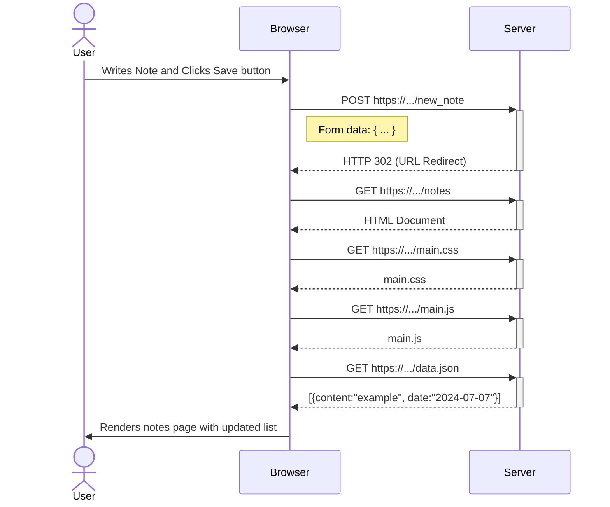

```mermaid
sequenceDiagram
    actor User
    participant Browser
    participant Server

    User->>Browser: Writes Note and Clicks Save button
    Browser->>+Server: POST https://.../new_note
    Note right of Browser: Form data: { ... }
    Server-->>-Browser: HTTP 302 (URL Redirect)
    Browser->>+Server: GET https://.../notes
    Server-->>-Browser: HTML Document
    Browser->>+Server: GET https://.../main.css
    Server-->>-Browser: main.css
    Browser->>+Server: GET https://.../main.js
    Server-->>-Browser: main.js
    Browser->>+Server: GET https://.../data.json
    Server-->>-Browser: [{content:"example", date:"2024-07-07"}]
    Browser->>User: Renders notes page with updated list
```