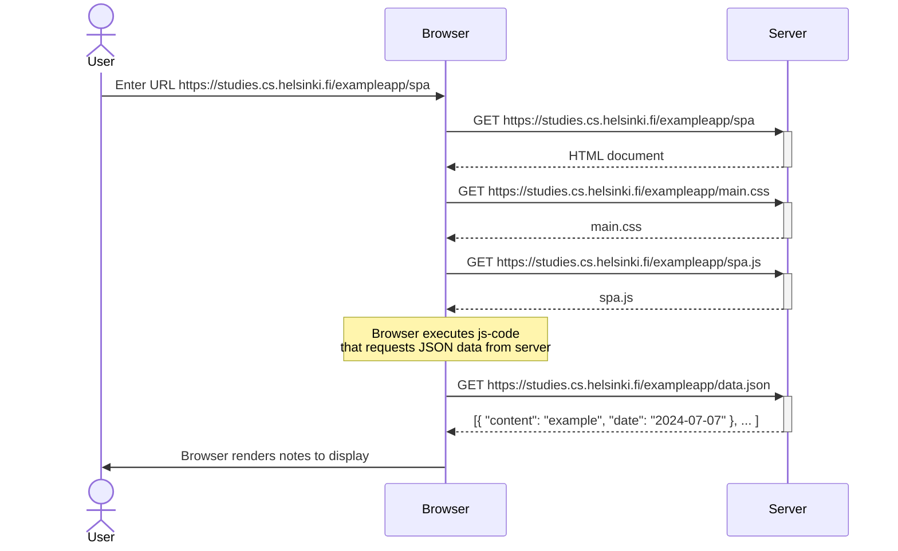

```mermaid
sequenceDiagram
    actor User
    participant Browser
    participant Server

    User->>Browser: Enter URL https://studies.cs.helsinki.fi/exampleapp/spa
    Browser->>+Server: GET https://studies.cs.helsinki.fi/exampleapp/spa
    Server-->>-Browser: HTML document
    Browser->>+Server: GET https://studies.cs.helsinki.fi/exampleapp/main.css
    Server-->>-Browser: main.css
    Browser->>+Server: GET https://studies.cs.helsinki.fi/exampleapp/spa.js
    Server-->>-Browser: spa.js
    Note over Browser: Browser executes js-code<br>that requests JSON data from server
    Browser->>+Server: GET https://studies.cs.helsinki.fi/exampleapp/data.json
    Server-->>-Browser: [{ "content": "example", "date": "2024-07-07" }, ... ]
    Browser->>User: Browser renders notes to display
```