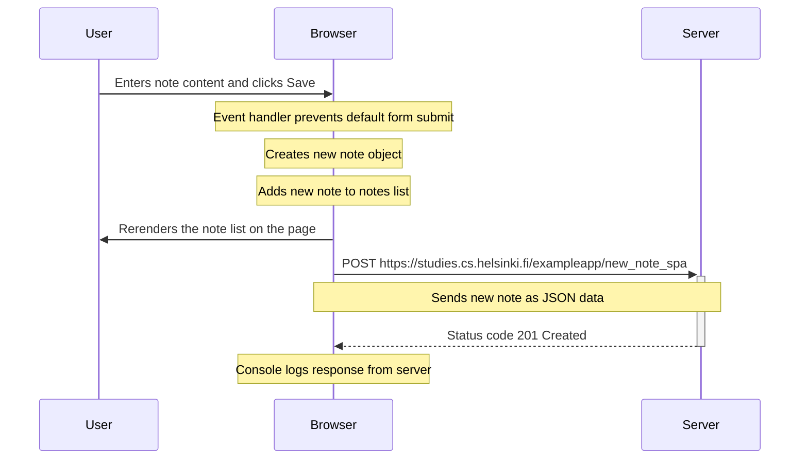

```mermaid
sequenceDiagram
    participant User
    participant Browser
    participant Server

    User->>Browser: Enters note content and clicks Save
    Note over Browser: Event handler prevents default form submit
    Note over Browser: Creates new note object
    Note over Browser: Adds new note to notes list
    Browser->>User: Rerenders the note list on the page
    Browser->>+Server: POST https://studies.cs.helsinki.fi/exampleapp/new_note_spa
    Note over Browser,Server: Sends new note as JSON data
    Server-->>-Browser: Status code 201 Created
    Note over Browser: Console logs response from server
```